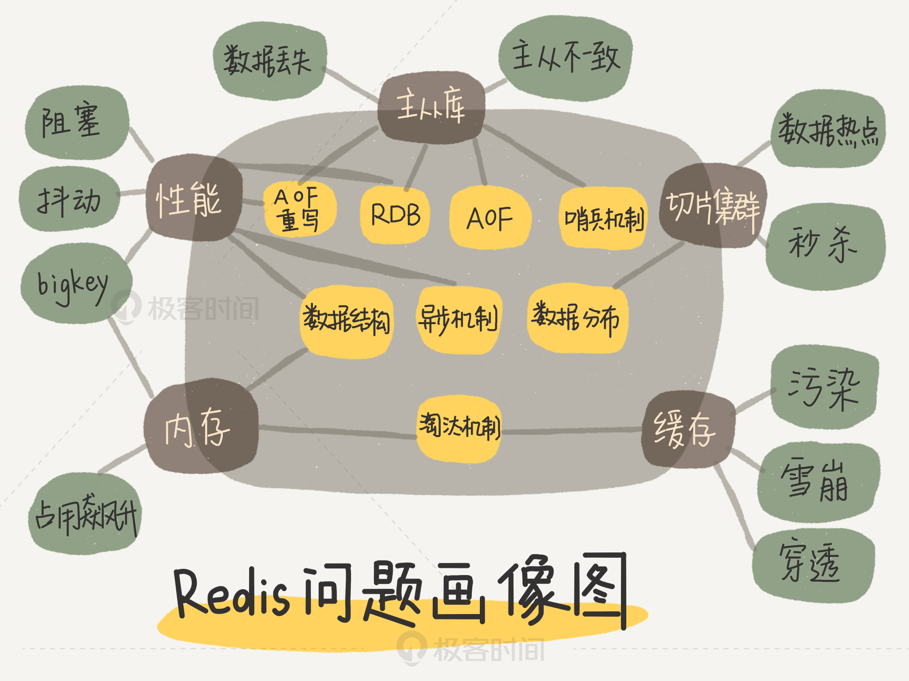
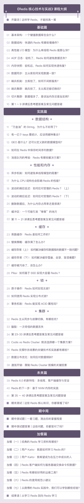

# 第 1 章 这样学Redis，才能技高一筹

作为键值数据库，Redis 的应用非常广泛，如果你是后端工程师，我猜你出去面试，八成都会被问到与它相关的性能问题。比如说，为了保证数据的可靠性，Redis 需要在磁盘上读写 **AOF 和 RDB**[^1]，但在高并发场景里，这就会直接带来两个新问题：一个是写 AOF 和 RDB 会造成 Redis 性能抖动，另一个是 Redis 集群数据同步和实例恢复时，读 RDB 比较慢，限制了同步和恢复速度。

正是因为有这样的研究和项目经历，让我目睹了同样是使用 Redis，但是不同公司的“玩法”却不太一样，比如说，有做缓存的，有做数据库的，也有用做分布式锁的。不过，他们遇见的“坑”，总体来说集中在四个方面：

1. CPU 使用上的“坑”，例如数据结构的复杂度、跨 CPU 核的访问；
2. 内存使用上的“坑”，例如主从同步和 AOF 的内存竞争；
3. 存储持久化上的“坑”，例如在 SSD 上做快照的性能抖动；
4. 网络通信上的“坑”，例如多实例时的异常网络丢包。

## 1. 为什么懂得了一个个技术点，却依然用不好 Redis？

我知道，很多同学都是带着一个个具体的问题来学这门课的，比如说，Redis 数据怎么做持久化？集群方案应该怎么做？这些问题当然很重要，但是，如果你只是急于解决这些细微的问题，你的 Redis 使用能力就很难得到质的提升。

这些年，在和国内大厂的合作过程中，我发现，很多技术人都有一个误区，那就是，**只关注零散的技术点，没有建立起一套完整的知识框架，缺乏系统观，但是，系统观其实是至关重要的**。从某种程度上说，在解决问题时，拥有了系统观，就意味着你能有依据、有章法地定位和解决问题。

现在，很多大厂的 Redis 服务面临的请求规模很大，因此，在评估性能时，仅仅看平均延迟已经不够了。我简单举个例子，假设 Redis 处理了 100 个请求，99 个请求的响应时间都是 1s，而有一个请求的响应时间是 100s。那么，如果看平均延迟，这 100 个请求的平均延迟是 1.99s，但是对于这个响应时间是 100s 的请求而言，它对应的用户体验将是非常糟糕的。如果有 100 万个请求，哪怕只有 1% 的请求是 100s，这也对应了 1 万个糟糕的用户体验。这 1% 的请求延迟就属于**长尾延迟**。

我之前在做一个项目的时候，要把 Redis 的长尾延迟维持在一定阈值以下。你可以想一下，如果是你，你会怎么做呢？刚开始的时候，我有些无从下手，因为那个时候，我并不清楚跟长尾延迟相关的东西都有哪些，只能一个个摸索。

首先，我对 Redis 的线程模型做了分析，我发现，对于单线程的 Redis 而言，任何阻塞性操作都会导致长尾延迟的产生。接着，我又开始寻找可能导致阻塞的关键因素，一开始想到的是网络阻塞，但随着对 Redis 网络框架的理解，我知道 Redis 网络 IO 使用了 IO 复用机制，并不会阻塞在单个客户端上。

再后来，我又把目光转向了键值对数据结构、持久化机制下的 fork 调用、主从库同步时的 AOF 重写，以及缓冲区溢出等多个方面。绕了一大圈子之后，这条影响长尾延迟的“证据链”才得以形成。这样一来，我也系统地掌握了影响 Redis 性能的关键因素路径，之后再碰到类似的问题时，我就可以轻松解决了。

## 2.  Redis 知识全景图

那么，如何高效地形成系统观呢？我们做事情一般都希望“多快好省”，说白了，就是希望花很少的时间掌握更丰富的知识和经验，解决更多的问题。听起来好像很难，但实际上，只要你能抓住主线，在自己的脑海中绘制一幅 Redis 全景知识图，这完全是可以实现的。而这，也是我在设计这门课时，所遵循的思路。

那么，所谓的 Redis 知识全景图都包括什么呢？简单来说，就是**“两大维度，三大主线”**。

“两大维度”就是指系统维度和应用维度，“三大主线”也就是指高性能、高可靠和高可扩展（可以简称为“三高”）。

==首先，从系统维度上说==，你需要了解 Redis 的各项关键技术的设计原理，这些能够为你判断和推理问题打下坚实的基础，而且，你还能从中掌握一些优雅的系统设计规范，例如 run-to-complete 模型、epoll 网络模型，这些可以应用到你后续的系统开发实践中。

这里有一个问题是，Redis 作为庞大的键值数据库，可以说遍地都是知识，一抓一大把，我们怎么能快速地知道该学哪些呢？别急，接下来就要看“三大主线”的魔力了。别看技术点是零碎的，其实你完全可以按照这三大主线，给它们分下类，就像图片中展示的那样，具体如下：

1. **高性能主线**，包括线程模型、数据结构、持久化、网络框架；
2. **高可靠主线**，包括主从复制、哨兵机制；
3. **高可扩展主线**，包括数据分片、负载均衡。

==其次，在应用维度上==，我建议你按照两种方式学习: **“应用场景驱动”和“典型案例驱动”**，一个是“面”的梳理，一个是“点”的掌握。

我们知道，缓存和集群是 Redis 的两大广泛的应用场景。在这些场景中，本身就具有一条显式的技术链。比如说，提到缓存场景，你肯定会想到缓存机制、缓存替换、缓存异常等一连串的问题。

不过，并不是所有的东西都适合采用这种方式，比如说 Redis 丰富的数据模型，就导致它有很多零碎的应用场景，很多很杂。而且，还有一些问题隐藏得比较深，只有特定的业务场景下（比如亿级访问压力场景）才会出现，并不是普遍现象，所以，我们也比较难于梳理出结构化的体系。

这个时候，你就可以用“典型案例驱动”的方式学习了。我们可以重点解读一些对 Redis 的“三高”特性影响较大的使用案例，例如，多家大厂在万亿级访问量和万亿级数据量的情况下对 Redis 的深度优化，解读这些优化实践，非常有助于你透彻地理解 Redis。而且，你还可以梳理一些方法论，做成 Checklist，就像是一个个锦囊，之后当你遇到问题的时候，就可以随时拿出自己的“锦囊妙计”解决问题了。

## 3. Redis 各大典型问题

最后，我还想跟你分享一个非常好用的技巧。我梳理了一下这些年遇到的、看到的 Redis 各大典型问题，同时结合相关的技术点，手绘了一张 Redis 的问题画像图。无论你遇见什么问题，都可以拿出来这张图，这样你就能快速地按照问题来查找对应的 Redis 主线模块了，然后再进一步定位到相应的技术点上。

举个例子，如果你遇到了 Redis 的响应变慢问题，对照着这张图，你就可以发现，这个问题和 Redis 的性能主线相关，而性能主线又和数据结构、异步机制、RDB、AOF 重写相关。找到了影响的因素，解决起来也就很容易了。

另外，在学习和使用的过程中，你完全可以根据你自己的方式，完善这张画像图，把你自己实践或掌握到的新知识点，按照**“问题 --> 主线 --> 技术点”**的方式梳理出来，放到这张图上。这样一来，你的积累越来越多，画像也会越来越丰富。以后在遇到问题的时候，就很容易解决了。

## 4. 课程目录

[^1]: RDB：Redis 默认开启，指定时间内执行指定次数写操作，将内存中的数据写入磁盘；AOF：需要手动开启，完整性更高，默认每秒将写操作日志追加写入到磁盘。