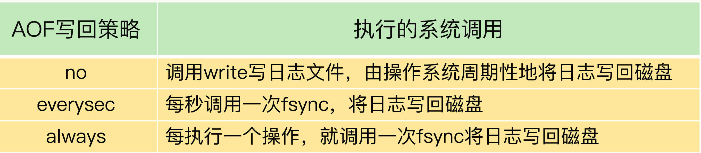

# 第 19 章 波动的响应延迟：如何应对变慢的Redis？（下）

如果上节课的方法不管用，那就说明，你要关注影响性能的其他机制了，也就是文件系统和操作系统。Redis 会持久化保存数据到磁盘，这个过程要依赖文件系统来完成，所以，文件系统将数据写回磁盘的机制，会直接影响到 Redis 持久化的效率。而且，在持久化的过程中，Redis 也还在接收其他请求，持久化的效率高低又会影响到 Redis 处理请求的性能。

另一方面，Redis 是内存数据库，内存操作非常频繁，所以，操作系统的内存机制会直接影响到 Redis 的处理效率。比如说，如果 Redis 的内存不够用了，操作系统会启动 swap 机制，这就会直接拖慢 Redis。

## 1. 文件系统：AOF 模式

你可能会问，Redis 是个内存数据库，为什么它的性能还和文件系统有关呢？我在前面讲过，为了保证数据可靠性，Redis 会采用 AOF 日志或 RDB 快照。其中，AOF 日志提供了三种日志写回策略：no、everysec、always，它们对应 `appendfsync` 配置项。这三种写回策略依赖文件系统的两个系统调用完成，也就是 write 和 fsync。



当写回策略配置为 everysec 和 always 时，Redis 需要调用 fsync 把日志写回磁盘。但是，这两种写回策略的具体执行情况还不太一样。

在使用 everysec 时，Redis 允许丢失一秒的操作记录，所以，Redis 主线程并不需要确保每个操作记录日志都写回磁盘。而且，fsync 的执行时间很长，如果是在 Redis 主线程中执行 fsync，就容易阻塞主线程。所以，**当写回策略配置为 everysec 时，Redis 会使用后台的子线程异步完成 fsync 的操作**。

而对于 always 策略来说，Redis 需要确保每个操作记录日志都写回磁盘，如果用后台子线程异步完成，主线程就无法及时地知道每个操作是否已经完成了，这就不符合 always 策略的要求了。所以，**always 策略并不使用后台子线程来执行**。

另外，在使用 AOF 日志时，为了避免日志文件不断增大，Redis 会执行 AOF 重写，生成体量缩小的新的 AOF 日志文件。AOF 重写本身需要的时间很长，也容易阻塞 Redis 主线程，所以，Redis 使用子进程来进行 AOF 重写。但是，这里有一个潜在的风险点：AOF 重写会对磁盘进行大量 IO 操作，同时，fsync 又需要等到数据写到磁盘后才能返回，所以，**当 AOF 重写的压力比较大时，就会导致 fsync 被阻塞**。虽然 fsync 是由后台子线程负责执行的，但是，主线程会监控 fsync 的执行进度。

当主线程使用后台子线程执行了一次 fsync，需要再次把新接收的操作记录写回磁盘时，如果主线程发现上一次的 fsync 还没有执行完，那么它就会阻塞。所以，如果后台子线程执行的 fsync 频繁阻塞的话（比如 AOF 重写占用了大量的磁盘 IO 带宽），主线程也会阻塞，导致 Redis 性能变慢。

如果业务应用对延迟非常敏感，但同时允许一定量的数据丢失，那么，可以把配置项 `no-appendfsync-on-rewrite` 设置为 yes。这个配置项设置为 yes 时，表示在 AOF 重写时，不进行 fsync 操作。也就是说，Redis 实例把写命令写到内存后，不调用后台线程进行 fsync 操作，就可以直接返回了。当然，如果此时实例发生宕机，就会导致数据丢失。反之，如果这个配置项设置为 no（也是默认配置），在 AOF 重写时，Redis 实例仍然会调用后台线程进行 fsync 操作，这就会给实例带来阻塞。

如果的确需要高性能，同时也需要高可靠数据保证，我建议你考虑采用高速的固态硬盘作为 AOF 日志的写入设备。

## 2. 操作系统：swap

内存 swap 是操作系统里将内存数据在内存和磁盘间来回换入和换出的机制，涉及到磁盘的读写，所以，一旦触发 swap，无论是被换入数据的进程，还是被换出数据的进程，其性能都会受到慢速磁盘读写的影响。

这一点对于 Redis 内存数据库而言，显得更为重要：正常情况下，Redis 的操作是直接通过访问内存就能完成，一旦 swap 被触发了，Redis 的请求操作需要等到磁盘数据读写完成才行。而且，和我刚才说的 AOF 日志文件读写使用 fsync 线程不同，swap 触发后影响的是 Redis 主 IO 线程，这会极大地增加 Redis 的响应时间。

那么，什么时候会触发 swap 呢？通常，触发 swap 的原因主要是物理机器内存不足，对于 Redis 而言，有两种常见的情况：

- Redis 实例自身使用了大量的内存，导致物理机器的可用内存不足；
- 和 Redis 实例在同一台机器上运行的其他进程，在进行大量的文件读写操作。文件读写本身会占用系统内存，这会导致分配给 Redis 实例的内存量变少，进而触发 Redis 发生 swap。

针对这个问题，我也给你提供一个解决思路：**增加机器的内存或者使用 Redis 集群**。

操作系统本身会在后台记录每个进程的 swap 使用情况，即有多少数据量发生了 swap。你可以先通过下面的命令查看 Redis 的进程号，这里是 5332。

```shell
$ redis-cli info | grep process_id
process_id: 5332
```

然后，进入 Redis 所在机器的 /proc 目录下的该进程目录中：

```shell
$ cd /proc/5332
```

最后，运行下面的命令，查看该 Redis 进程的使用情况。在这儿，我只截取了部分结果：

```shell
$cat smaps | egrep '^(Swap|Size)'
Size: 584 kB
Swap: 0 kB
Size: 4 kB
Swap: 4 kB
Size: 4 kB
Swap: 0 kB
Size: 462044 kB
Swap: 462008 kB
Size: 21392 kB
Swap: 0 kB
```

每一行 Size 表示的是 Redis 实例所用的一块内存大小，而 Size 下方的 Swap 和它相对应，表示这块 Size 大小的内存区域有多少已经被换出到磁盘上了。如果这两个值相等，就表示这块内存区域已经完全被换出到磁盘了。

当出现百 MB，甚至 GB 级别的 swap 大小时，就表明，此时，Redis 实例的内存压力很大，很有可能会变慢。所以，swap 的大小是排查 Redis 性能变慢是否由 swap 引起的重要指标。

一旦发生内存 swap，最直接的解决方法就是增加机器内存。如果该实例在一个 Redis 切片集群中，可以增加 Redis 集群的实例个数，来分摊每个实例服务的数据量，进而减少每个实例所需的内存量。

当然，如果 Redis 实例和其他操作大量文件的程序（例如数据分析程序）共享机器，你可以将 Redis 实例迁移到单独的机器上运行，以满足它的内存需求量。如果该实例正好是 Redis 主从集群中的主库，而从库的内存很大，也可以考虑进行主从切换，把大内存的从库变成主库，由它来处理客户端请求。

## 3. 操作系统：内存大页

除了内存 swap，还有一个和内存相关的因素，即**内存大页机制（Transparent Huge Page, THP）**，也会影响 Redis 性能。Linux 内核从 2.6.38 开始支持内存大页机制，该机制支持 2MB 大小的内存页分配，而常规的内存页分配是按 4KB 的粒度来执行的。

虽然内存大页可以给 Redis 带来内存分配方面的收益，但是，不要忘了，Redis 为了提供数据可靠性保证，需要将数据做持久化保存。这个写入过程由额外的线程执行，所以，此时，Redis 主线程仍然可以接收客户端写请求。客户端的写请求可能会修改正在进行持久化的数据。在这一过程中，Redis 就会采用写时复制机制，也就是说，一旦有数据要被修改，Redis 并不会直接修改内存中的数据，而是将这些数据拷贝一份，然后再进行修改。

如果采用了内存大页，那么，即使客户端请求只修改 100B 的数据，Redis 也需要拷贝 2MB 的大页。相反，如果是常规内存页机制，只用拷贝 4KB。两者相比，你可以看到，当客户端请求修改或新写入数据较多时，内存大页机制将导致大量的拷贝，这就会影响 Redis 正常的访存操作，最终导致性能变慢。

那该怎么办呢？很简单，关闭内存大页，就行了。首先，我们要先排查下内存大页。方法是：在 Redis 实例运行的机器上执行如下命令:

```shell
$ cat /sys/kernel/mm/transparent_hugepage/enabled
```

如果执行结果是 always，就表明内存大页机制被启动了；如果是 never，就表示，内存大页机制被禁止；如果是 always [madvise] never，表示采用了madvise 的方式来处理，意思是只有显式地使用了`madvise(MADV_HUGEPAGE)` 相关的接口,才启用内存大页机制。

在实际生产环境中部署时，我建议你不要使用内存大页机制，操作也很简单，只需要执行下面的命令就可以了：

```shell
$ echo never > /sys/kernel/mm/transparent_hugepage/enabled
```

## 4. 每课一问

你遇到过 Redis 变慢的情况吗？如果有的话，你是怎么解决的呢？

关于如何分析、排查、解决Redis变慢问题，我总结的checklist如下：

1. 使用复杂度过高的命令（例如`SORT/SUION/ZUNIONSTORE/KEYS`），或一次查询全量数据（例如`LRANGE key 0 N`，但N很大）

   1. 分析

      - 查看[slowlog](http://doc.redisfans.com/server/slowlog.html)是否存在这些命令

      - Redis进程CPU使用率是否飙升（聚合运算命令导致）

   2. 解决

      - 不使用复杂度过高的命令，或用其他方式代替实现（放在客户端做）
      - 数据尽量分批查询（`LRANGE key 0 N`，建议N<=100，查询全量数据建议使用`HSCAN/SSCAN/ZSCAN`）

2. 操作bigkey

   1. 分析
      - slowlog出现很多`SET/DELETE`变慢命令（bigkey分配内存和释放内存变慢）
      - 使用`redis-cli -h $host -p $port --bigkeys`扫描出很多bigkey
   2. 解决
      - 优化业务，避免存储bigkey
      - Redis 4.0+可开启lazy-free机制

3. 大量key集中过期

   1. 分析
      - 业务使用`EXPIREAT/PEXPIREAT`命令
      - Redis info中的expired_keys指标短期突增
   2. 解决
      - 优化业务，过期增加随机时间，把时间打散，减轻删除过期key的压力
      - 运维层面，监控expired_keys指标，有短期突增及时报警排查

4. Redis内存达到maxmemory

   1. 分析
      - 实例内存达到maxmemory，且写入量大，淘汰key压力变大
      - Redis info中的evicted_keys指标短期突增
   2. 解决
      - 业务层面，根据情况调整淘汰策略（随机比LRU快）
      - 运维层面，监控evicted_keys指标，有短期突增及时报警
      - 集群扩容，多个实例减轻淘汰key的压力

5. 大量短连接请求

   1. 分析：Redis处理大量短连接请求，TCP三次握手和四次挥手也会增加耗时
   2. 解决：使用长连接操作Redis

6. 生成RDB和AOF重写fork耗时严重

   1. 分析
      - Redis变慢只发生在生成RDB和AOF重写期间 
      - 实例占用内存越大，fork拷贝内存页表越久
      - Redis info中latest_fork_usec耗时变长
   2. 解决
      - 实例尽量小
      - Redis尽量部署在物理机上
      - 优化备份策略（例如低峰期备份）
      - 合理配置repl-backlog和slave client-output-buffer-limit，避免主从全量同步
      - 视情况考虑关闭AOF
      - 监控latest_fork_usec耗时是否变长

7. AOF使用awalys机制

   1. 分析：磁盘IO负载变高
   2. 解决
      - 使用everysec机制
      - 丢失数据不敏感的业务不开启AOF

8. 使用Swap

   1. 分析
      - 所有请求全部开始变慢 
      - slowlog大量慢日志
      - 查看Redis进程是否使用到了Swap
   2. 解决
      - 增加机器内存
      - 集群扩容
      - Swap使用时监控报警

9. 进程绑定CPU不合理

   1. 分析
      - Redis进程只绑定一个CPU逻辑核
      - NUMA架构下，网络中断处理程序和Redis进程没有绑定在同一个Socket下
   2. 解决
      - Redis进程绑定多个CPU逻辑核
      - 网络中断处理程序和Redis进程绑定在同一个Socket下

10. 开启内存大页机制

    1. 分析：生成RDB和AOF重写期间，主线程处理写请求耗时变长（拷贝内存副本耗时变长）
    2. 解决：关闭内存大页机制

11. 网卡负载过高

    1. 分析
       - TCP/IP层延迟变大，丢包重传变多
       - 是否存在流量过大的实例占满带宽
    2. 解决
       - 机器网络资源监控，负载过高及时报警
       - 提前规划部署策略，访问量大的实例隔离部署