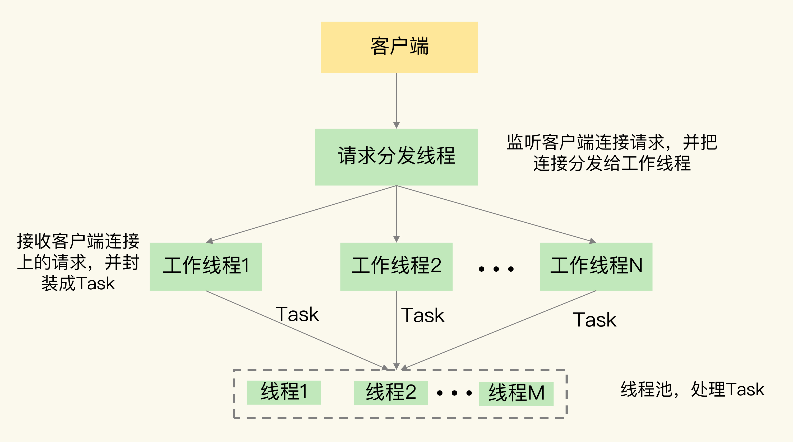
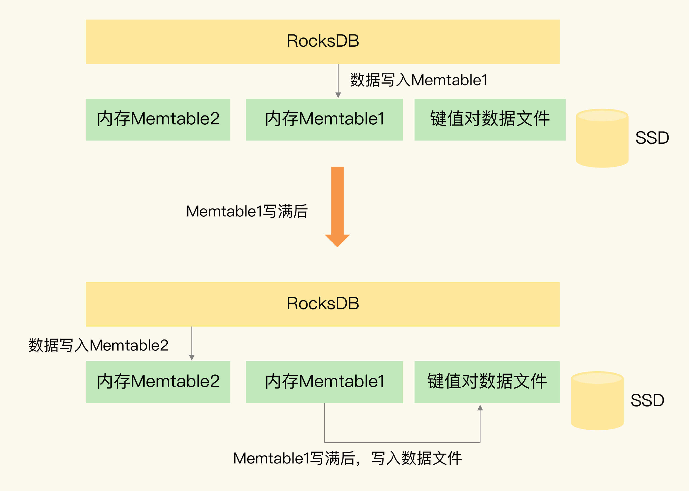
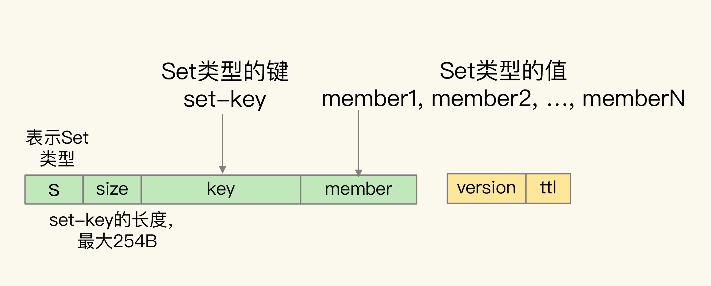
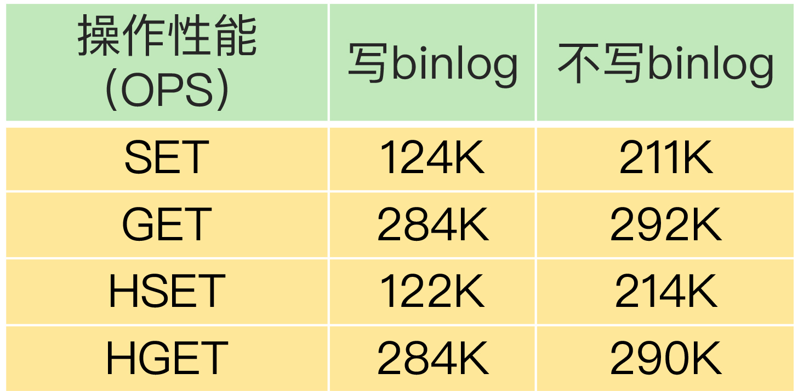

# 第 28 章 Pika：如何基于SSD实现大容量Redis？

我们在应用 Redis 时，随着业务数据的增加（比如说电商业务中，随着用户规模和商品数量的增加），就需要 Redis 能保存更多的数据。你可能会想到使用 Redis 切片集群，把数据分散保存到多个实例上。但是这样做的话，会有一个问题，如果要保存的数据总量很大，但是每个实例保存的数据量较小的话，就会导致集群的实例规模增加，这会让集群的运维管理变得复杂，增加开销。

你可能又会说，我们可以通过增加 Redis 单实例的内存容量，形成大内存实例，每个实例可以保存更多的数据，这样一来，在保存相同的数据总量时，所需要的大内存实例的个数就会减少，就可以节省开销。这是一个好主意，但这也并不是完美的方案：基于大内存的大容量实例在实例恢复、主从同步过程中会引起一系列潜在问题，例如恢复时间增长、主从切换开销大、缓冲区易溢出。

那怎么办呢？我推荐你使用固态硬盘（Solid State Drive，SSD）。它的成本很低（每 GB 的成本约是内存的十分之一），而且容量大，读写速度快，我们可以基于 SSD 来实现大容量的 Redis 实例。360 公司 DBA 和基础架构组联合开发的 [Pika键值数据库](https://github.com/Qihoo360/pika)，正好实现了这一需求。

Pika 在刚开始设计的时候，就有两个目标：一是，单实例可以保存大容量数据，同时避免了实例恢复和主从同步时的潜在问题；二是，和 Redis 数据类型保持兼容，可以支持使用 Redis 的应用平滑地迁移到 Pika 上。所以，如果你一直在使用 Redis，并且想使用 SSD 来扩展单实例容量，Pika 就是一个很好的选择。

## 1. Pika 的整体架构

Pika 键值数据库的整体架构中包括了五部分，分别是网络框架、Pika 线程模块、Nemo 存储模块、RocksDB 和 binlog 机制。

首先，网络框架主要负责底层网络请求的接收和发送。Pika 的网络框架是对操作系统底层的网络函数进行了封装。Pika 在进行网络通信时，可以直接调用网络框架封装好的函数。

其次，Pika 线程模块采用了多线程模型来具体处理客户端请求，包括一个请求分发线程（DispatchThread）、一组工作线程（WorkerThread）以及一个线程池（ThreadPool）。

请求分发线程专门监听网络端口，一旦接收到客户端的连接请求后，就和客户端建立连接，并把连接交由工作线程处理。工作线程负责接收客户端连接上发送的具体命令请求，并把命令请求封装成 Task，再交给线程池中的线程，由这些线程进行实际的数据存取处理，如下图所示：



Nemo 模块很容易理解，它实现了 Pika 和 Redis 的数据类型兼容。这样一来，当我们把 Redis 服务迁移到 Pika 时，不用修改业务应用中操作 Redis 的代码，而且还可以继续应用运维 Redis 的经验，这使得 Pika 的学习成本就较低。Nemo 模块对数据类型的具体转换机制是我们要重点关心的，下面我会具体介绍。

最后，我们再来看看 RocksDB 提供的基于 SSD 保存数据的功能。它使得 Pika 可以不用大容量的内存，就能保存更多数据，还避免了使用内存快照。而且，Pika 使用 binlog 机制记录写命令，用于主从节点的命令同步，避免了刚刚所说的大内存实例在主从同步过程中的潜在问题。

## 2. Pika 如何基于 SSD 保存更多数据？

为了把数据保存到 SSD，Pika 使用了业界广泛应用的持久化键值数据库RocksDB。RocksDB 本身的实现机制较为复杂，你不需要全部弄明白，你只要记住 RocksDB 的基本数据读写机制，对于学习了解 Pika 来说，就已经足够了。下面我来解释下这个基本读写机制。

下面我结合一张图片，来给你具体介绍下 RocksDB 写入数据的基本流程。



当 Pika 需要保存数据时，RocksDB 会使用两小块内存空间（Memtable1 和 Memtable2）来交替缓存写入的数据。Memtable 的大小可以设置，一个 Memtable 的大小一般为几 MB 或几十 MB。当有数据要写入 RocksDB 时，RocksDB 会先把数据写入到 Memtable1。等到 Memtable1 写满后，RocksDB 再把数据以文件的形式，快速写入底层的 SSD。同时，RocksDB 会使用 Memtable2 来代替 Memtable1，缓存新写入的数据。等到 Memtable1 的数据都写入 SSD 了，RocksDB 会在 Memtable2 写满后，再用 Memtable1 缓存新写入的数据。

这么一分析你就知道了，RocksDB 会先用 Memtable 缓存数据，再将数据快速写入 SSD，即使数据量再大，所有数据也都能保存到 SSD 中。而且，Memtable 本身容量不大，即使 RocksDB 使用了两个 Memtable，也不会占用过多的内存，这样一来，Pika 在保存大容量数据时，也不用占据太大的内存空间了。

当 Pika 需要读取数据的时候，RocksDB 会先在 Memtable 中查询是否有要读取的数据。这是因为，最新的数据都是先写入到 Memtable 中的。如果 Memtable 中没有要读取的数据，RocksDB 会再查询保存在 SSD 上的数据文件。

当使用大内存实例保存大量数据时，Redis 会面临 RDB 生成和恢复的效率问题，以及主从同步时的效率和缓冲区溢出问题。那么，当 Pika 保存大量数据时，还会面临相同的问题吗？其实不会了，我们来分析一下。

一方面，Pika 基于 RocksDB 保存了数据文件，直接读取数据文件就能恢复，不需要再通过内存快照进行恢复了。而且，Pika 从库在进行全量同步时，可以直接从主库拷贝数据文件，不需要使用内存快照，这样一来，Pika 就避免了大内存快照生成效率低的问题。

另一方面，Pika 使用了 binlog 机制实现增量命令同步，既节省了内存，还避免了缓冲区溢出的问题。binlog 是保存在 SSD 上的文件，Pika 接收到写命令后，在把数据写入 Memtable 时，也会把命令操作写到 binlog 文件中。和 Redis 类似，当全量同步结束后，从库会从 binlog 中把尚未同步的命令读取过来，这样就可以和主库的数据保持一致。当进行增量同步时，从库也是把自己已经复制的偏移量发给主库，主库把尚未同步的命令发给从库，来保持主从库的数据一致。

现在，我们先简单小结下。Pika 使用 RocksDB 把大量数据保存到了 SSD，同时避免了内存快照的生成和恢复问题。而且，Pika 使用 binlog 机制进行主从同步，避免大内存时的影响，Pika 的第一个设计目标就实现了。

## 3. Pika 如何实现 Redis 数据类型兼容？

Pika 的底层存储使用了 RocksDB 来保存数据，但是，RocksDB 只提供了单值的键值对类型，RocksDB 键值对中的值就是单个值，而 Redis 键值对中的值还可以是集合类型。

对于 Redis 的 String 类型来说，它本身就是单值的键值对，我们直接用 RocksDB 保存就行。但是，对于集合类型来说，我们就无法直接把集合保存为单值的键值对，而是需要进行转换操作。为了保持和 Redis 的兼容性，Pika 的 Nemo 模块就负责把 Redis 的集合类型转换成单值的键值对。简单来说，我们可以把 Redis 的集合类型分成两类：

- 一类是 List 和 Set 类型，它们的集合中也只有单值；
- 另一类是 Hash 和 Sorted Set 类型，它们的集合中的元素是成对的，其中，Hash 集合元素是 field-value 类型，而 Sorted Set 集合元素是 member-score 类型。

首先我们来看 List 类型。在 Pika 中，List 集合的 key 被嵌入到了单值键值对的键当中，用 key 字段表示；而 List 集合的元素值，则被嵌入到单值键值对的值当中，用 value 字段表示。因为 List 集合中的元素是有序的，所以，Nemo 模块还在单值键值对的 key 后面增加了 sequence 字段，表示当前元素在 List 中的顺序，同时，还在 value 的前面增加了 previous sequence 和 next sequence 这两个字段，分别表示当前元素的前一个元素和后一个元素。

此外，在单值键值对的 key 前面，Nemo 模块还增加了一个值“l”，表示当前数据是 List 类型，以及增加了一个 1 字节的 size 字段，表示 List 集合 key 的大小。在单值键值对的 value 后面，Nemo 模块还增加了 version 和 ttl 字段，分别表示当前数据的版本号和剩余存活时间（用来支持过期 key 功能），如下图所示：


我们再来看看 Set 集合。Set 集合的 key 和元素 member 值，都被嵌入到了 Pika 单值键值对的键当中，分别用 key 和 member 字段表示。同时，和 List 集合类似，单值键值对的 key 前面有值“s”，用来表示数据是 Set 类型，同时还有 size 字段，用来表示 key 的大小。Pika 单值键值对的值只保存了数据的版本信息和剩余存活时间，如下图所示：



对于 Hash 类型来说，Hash 集合的 key 被嵌入到单值键值对的键当中，用 key 字段表示，而 Hash 集合元素的 field 也被嵌入到单值键值对的键当中，紧接着 key 字段，用 field 字段表示。Hash 集合元素的 value 则是嵌入到单值键值对的值当中，并且也带有版本信息和剩余存活时间，如下图所示：


## 4. Pika 的其他优势与不足

跟 Redis 相比，Pika 最大的特点就是使用了 SSD 来保存数据，这个特点能带来的最直接好处就是，Pika 单实例能保存更多的数据了，实现了实例数据扩容。除此之外，Pika 使用 SSD 来保存数据，还有额外的两个优势。

首先，实例重启快。Pika 的数据在写入数据库时，是会保存到 SSD 上的。当 Pika 实例重启时，可以直接从 SSD 上的数据文件中读取数据，不需要像 Redis 一样，从 RDB 文件全部重新加载数据或是从 AOF 文件中全部回放操作，这极大地提高了 Pika 实例的重启速度，可以快速处理业务应用请求。

另外，主从库重新执行全量同步的风险低。Pika 通过 binlog 机制实现写命令的增量同步，不再受内存缓冲区大小的限制，所以，即使在数据量很大导致主从库同步耗时很长的情况下，Pika 也不用担心缓冲区溢出而触发的主从库重新全量同步。

Pika 也有自身的一些不足。虽然它保持了 Redis 操作接口，也能实现数据库扩容，但是，当把数据保存到 SSD 上后，会降低数据的访问性能。这是因为，数据操作毕竟不能在内存中直接执行了，而是要在底层的 SSD 中进行存取，这肯定会影响，Pika 的性能。而且，我们还需要把 binlog 机制记录的写命令同步到 SSD 上，这会降低 Pika 的写性能。

不过，Pika 的多线程模型，可以同时使用多个线程进行数据读写，这在一定程度上弥补了从 SSD 存取数据造成的性能损失。当然，你也可以使用高配的 SSD 来提升访问性能，进而减少读写 SSD 对 Pika 性能的影响。

为了帮助你更直观地了解 Pika 的性能情况，我再给你提供一张表，这是 Pika官网上提供的测试数据。



这些数据是在 Pika 3.2 版本中，String 和 Hash 类型在多线程情况下的基本操作性能结果。从表中可以看到，在不写 binlog 时，Pika 的 SET/GET、HSET/HGET 的性能都能达到 200K OPS 以上，而一旦增加了写 binlog 操作，SET 和 HSET 操作性能大约下降了 41%，只有约 120K OPS。

## 5. 小结

Pika 本身提供了很多工具，可以帮助我们把 Redis 数据迁移到 Pika，或者是把 Redis 请求转发给 Pika。比如说，我们使用 aof_to_pika 命令，并且指定 Redis 的 AOF 文件以及 Pika 的连接信息，就可以把 Redis 数据迁移到 Pika 中了，如下所示：

```shell
$ aof_to_pika -i [Redis AOF文件] -h [Pika IP] -p [Pika port] -a [认证信息]
```

## 6. 每课一问

我们可以使用机械硬盘来作为实例容量扩展吗，有什么好处或不足吗？

我觉得也是可以的。机械硬盘相较于固态硬盘的优点是，成本更低、容量更大、寿命更长。

1. 成本：机械硬盘是电磁存储，固态硬盘是半导体电容颗粒组成，相同容量下机械硬盘成本是固态硬盘的1/3。
2. 容量：相同成本下，机械硬盘可使用的容量更大。
3. 寿命：固态硬盘的电容颗粒擦写次数有限，超过一定次数后会不可用。相同ops情况下，机械硬盘的寿命要比固态硬盘的寿命更长。

但机械硬盘相较于固态硬盘的缺点也很明显，就是速度慢。 机械硬盘在读写数据时，需要通过转动磁盘和磁头等机械方式完成，而固态硬盘是直接通过电信号保存和控制数据的读写，速度非常快。

如果对于访问延迟要求不高，对容量和成本比较关注的场景，可以把Pika部署在机械硬盘上使用。