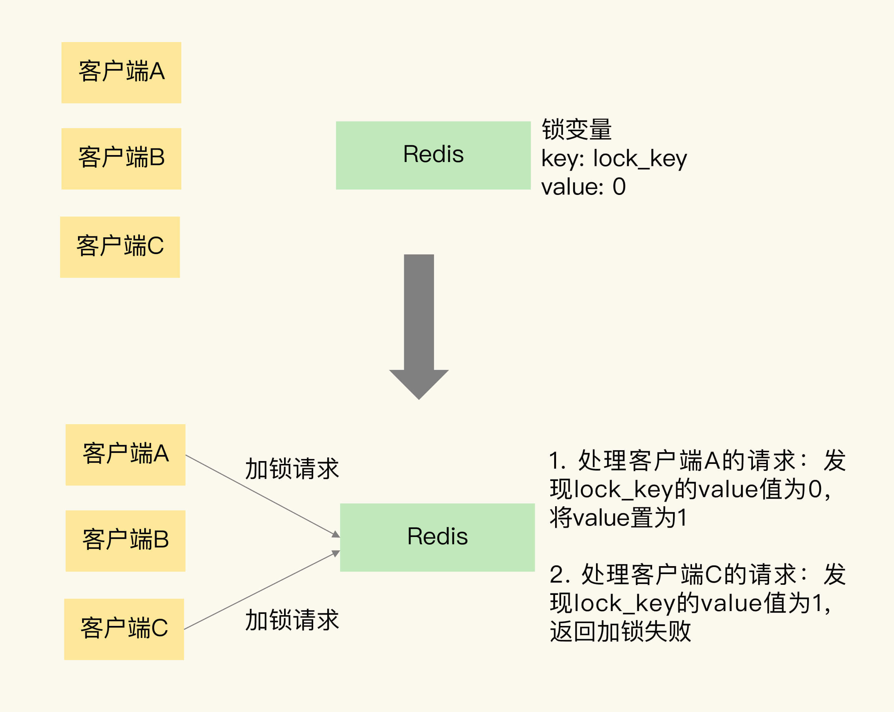

# 第 30 章 如何使用Redis实现分布式锁？

Redis 属于分布式系统，当有多个客户端需要争抢锁时，我们必须要保证，这把锁不能是某个客户端本地的锁。否则的话，其它客户端是无法访问这把锁的，当然也就不能获取这把锁了。所以，在分布式系统中，当有多个客户端需要获取锁时，我们需要分布式锁。此时，锁是保存在一个共享存储系统中的，可以被多个客户端共享访问和获取。

Redis 本身可以被多个客户端共享访问，正好就是一个共享存储系统，可以用来保存分布式锁。而且 Redis 的读写性能高，可以应对高并发的锁操作场景。所以，这节课，我就来和你聊聊如何基于 Redis 实现分布式锁。

## 1. 单机上的锁和分布式锁的联系与区别

实际上，一个线程调用加锁操作，其实就是检查锁变量值是否为 0。如果是 0，就把锁的变量值设置为 1，表示获取到锁，如果不是 0，就返回错误信息，表示加锁失败，已经有别的线程获取到锁了。而一个线程调用释放锁操作，其实就是将锁变量的值置为 0，以便其它线程可以来获取锁。

和单机上的锁类似，分布式锁同样可以用一个变量来实现。客户端加锁和释放锁的操作逻辑，也和单机上的加锁和释放锁操作逻辑一致：加锁时同样需要判断锁变量的值，根据锁变量值来判断能否加锁成功；释放锁时需要把锁变量值设置为 0，表明客户端不再持有锁。

但是，和线程在单机上操作锁不同的是，在分布式场景下，锁变量需要由一个共享存储系统来维护，只有这样，多个客户端才可以通过访问共享存储系统来访问锁变量。相应的，加锁和释放锁的操作就变成了读取、判断和设置共享存储系统中的锁变量值。这样一来，我们就可以得出实现分布式锁的两个要求。

- 要求一：分布式锁的加锁和释放锁的过程，涉及多个操作。所以，在实现分布式锁时，我们需要保证这些锁操作的原子性；
- 要求二：共享存储系统保存了锁变量，如果共享存储系统发生故障或宕机，那么客户端也就无法进行锁操作了。在实现分布式锁时，我们需要考虑保证共享存储系统的可靠性，进而保证锁的可靠性。

## 2. 基于单个 Redis 节点实现分布式锁

作为分布式锁实现过程中的共享存储系统，Redis 可以使用键值对来保存锁变量，再接收和处理不同客户端发送的加锁和释放锁的操作请求。那么，键值对的键和值具体是怎么定的呢？Redis 可以使用一个键值对 lock_key:0 来保存锁变量，其中，键是 lock_key，也是锁变量的名称，锁变量的初始值是 0。



我们再来分析下加锁操作。在图中，客户端 A 和 C 同时请求加锁。因为 Redis 使用单线程处理请求，所以，即使客户端 A 和 C 同时把加锁请求发给了 Redis，Redis 也会串行处理它们的请求。

我们假设 Redis 先处理客户端 A 的请求，读取 lock_key 的值，发现 lock_key 为 0，所以，Redis 就把 lock_key 的 value 置为 1，表示已经加锁了。紧接着，Redis 处理客户端 C 的请求，此时，Redis 会发现 lock_key 的值已经为 1 了，所以就返回加锁失败的信息。

刚刚说的是加锁的操作，那释放锁该怎么操作呢？其实，释放锁就是直接把锁变量值设置为 0。

因为加锁包含了三个操作（读取锁变量、判断锁变量值以及把锁变量值设置为 1），而这三个操作在执行时需要保证原子性。那怎么保证原子性呢？上节课，我们学过，要想保证操作的原子性，有两种通用的方法，分别是使用 Redis 的单命令操作和使用 Lua 脚本。那么，在分布式加锁场景下，该怎么应用这两个方法呢？

我们先来看下，Redis 可以用哪些单命令操作实现加锁操作。首先是 `SETNX` 命令，它用于设置键值对的值。具体来说，就是这个命令在执行时会判断键值对是否存在，如果不存在，就设置键值对的值，如果存在，就不做任何设置。对于释放锁操作来说，我们可以在执行完业务逻辑后，使用 `DEL` 命令删除锁变量。

不过，使用 `SETNX` 和 `DEL` 命令组合实现分布锁，存在两个潜在的风险。

### 2.1 第一个风险

第一个风险是，假如某个客户端在执行了 `SETNX` 命令、加锁之后，紧接着却在操作共享数据时发生了异常，结果一直没有执行最后的 `DEL` 命令释放锁。因此，锁就一直被这个客户端持有，其它客户端无法拿到锁，也无法访问共享数据和执行后续操作，这会给业务应用带来影响。

针对这个问题，一个有效的解决方法是，给锁变量设置一个过期时间。这样一来，即使持有锁的客户端发生了异常，无法主动地释放锁，Redis 也会根据锁变量的过期时间，在锁变量过期后，把它删除。其它客户端在锁变量过期后，就可以重新请求加锁，这就不会出现无法加锁的问题了。

### 2.2 第二个风险

我们再来看第二个风险。假设客户端 A 执行完 `SETNX` 命令成功加锁，并且给锁设置了超时时间 10s，然后开始执行业务逻辑，但是由于其他原因导致执行业务逻辑时间超出了 10s ，锁自动释放了，注意客户端 A 的业务逻辑仍然在执行中，此时客户端 B 成功加锁并且设置锁超时时间，而后开始执行业务逻辑，但是在客户端 B 执行业务逻辑期间，客户端 A 执行完毕，然后开始调用 `DEL` 指令释放锁，这就有可能导致将客户端 B 加的锁释放掉。

为了应对这个问题，我们需要能区分来自不同客户端的锁操作，具体咋做呢？我们在加锁操作时，可以让每个客户端给锁变量设置一个唯一值，这里的唯一值就可以用来标识当前操作的客户端。在释放锁操作时，客户端需要判断，当前锁变量的值是否和自己的唯一标识相等，只有在相等的情况下，才能释放锁。这样一来，就不会出现误释放锁的问题了。

为了能达到和 `SETNX` 命令一样的效果，Redis 给 `SET` 命令提供了类似的选项 `NX`，用来实现“不存在即设置”。如果使用了 `NX` 选项，`SET` 命令只有在键值对不存在时，才会进行设置，否则不做赋值操作。此外，`SET` 命令在执行时还可以带上 `EX` 或 `PX` 选项，用来设置键值对的过期时间。

```shell
$ SET key value [EX seconds | PX milliseconds]  [NX]
```

因为在加锁操作中，每个客户端都使用了一个唯一标识，所以在释放锁操作时，我们需要判断锁变量的值，是否等于执行释放锁操作的客户端的唯一标识，如下所示：

```lua
//释放锁 比较unique_value是否相等，避免误释放
if redis.call("get",KEYS[1]) == ARGV[1] then
    return redis.call("del",KEYS[1])
else
    return 0
end
```

这是使用 Lua 脚本（unlock.script）实现的释放锁操作的伪代码，其中，`KEYS[1]`表示 lock_key，`ARGV[1]`是当前客户端的唯一标识，这两个值都是我们在执行 Lua 脚本时作为参数传入的。最后，我们执行下面的命令，就可以完成锁释放操作了。

```shell
$ redis-cli  --eval  unlock.script lock_key , unique_value 
```

### 2.3 第三个风险

注意锁上有过期时间，如果过期时间内客户端没有完成操作，锁被释放了，可此时客户端还在没有执行完。这个问题有两种解决办法

- 一是提前预估好，保证超时时间大于执行时间

- 二是使用看门狗，客户端需要在执行的过程中隔一段时间就去延长过期时间，此操作可以放在另一个线程中执行。

## 3. 基于多个 Redis 节点实现高可靠的分布式锁

为了避免 Redis 实例故障而导致的锁无法工作的问题，Redis 的开发者 Antirez 提出了分布式锁算法 Redlock。

Redlock 算法的基本思路，是让客户端和多个独立的 Redis 实例依次请求加锁，如果客户端能够和半数以上的实例成功地完成加锁操作，那么我们就认为，客户端成功地获得分布式锁了，否则加锁失败。这样一来，即使有单个 Redis 实例发生故障，因为锁变量在其它实例上也有保存，所以，客户端仍然可以正常地进行锁操作，锁变量并不会丢失。

我们来具体看下 Redlock 算法的执行步骤。Redlock 算法的实现需要有 N 个独立的 Redis 实例。接下来，我们可以分成 3 步来完成加锁操作。

### 3.1 第一步是，客户端获取当前时间

### 3.2 第二步是，客户端按顺序依次向 N 个 Redis 实例执行加锁操作

这里的加锁操作和在单实例上执行的加锁操作一样，使用 `SET` 命令，带上 `NX`，`EX/PX` 选项，以及带上客户端的唯一标识。当然，如果某个 Redis 实例发生故障了，为了保证在这种情况下，Redlock 算法能够继续运行，我们需要给加锁操作设置一个超时时间。

如果客户端在和一个 Redis 实例请求加锁时，一直到超时都没有成功，那么此时，客户端会和下一个 Redis 实例继续请求加锁。加锁操作的超时时间需要远远地小于锁的有效时间，一般也就是设置为几十毫秒。

### 3.3 第三步是，一旦客户端完成了和所有 Redis 实例的加锁操作，客户端就要计算整个加锁过程的总耗时

客户端只有在满足下面的这两个条件时，才能认为是加锁成功。

- 条件一：客户端从超过半数（大于等于 N/2+1）的 Redis 实例上成功获取到了锁；
- 条件二：客户端获取锁的总耗时没有超过锁的有效时间。

在满足了这两个条件后，我们需要重新计算这把锁的有效时间，计算的结果是锁的最初有效时间减去客户端为获取锁的总耗时。如果锁的有效时间已经来不及完成共享数据的操作了，我们可以释放锁，以免出现还没完成数据操作，锁就过期了的情况。

当然，如果客户端在和所有实例执行完加锁操作后，没能同时满足这两个条件，那么，客户端向所有 Redis 节点发起释放锁的操作。

在 Redlock 算法中，释放锁对所有节点释放（即使某个节点加锁失败了），它的操作和在单实例上释放锁的操作一样，只要执行释放锁的 Lua 脚本就可以了。这样一来，只要 N 个 Redis 实例中的半数以上实例能正常工作，就能保证分布式锁的正常工作了。

### 3.4 小结

使用单个 Redis 节点（只有一个master）使用分布锁，如果实例宕机，那么无法进行锁操作了。那么采用主从集群模式部署是否可以保证锁的可靠性？ 

答案是也很难保证。如果在 master 上加锁成功，此时 master 宕机，由于主从复制是异步的，加锁操作的命令还未同步到 slave，此时主从切换，新 master 节点依旧会丢失该锁，对业务来说相当于锁失效了。

所以 Redis 作者才提出基于多个 Redis 节点（master节点）的 Redlock 算法，但这个算法涉及的细节很多，作者在提出这个算法时，业界的分布式系统专家还与 Redis 作者发生过一场争论，来评估这个算法的可靠性，争论的细节都是关于异常情况可能导致 Redlock 失效的场景，例如加锁过程中客户端发生了阻塞、机器时钟发生跳跃等等。 

感兴趣的可以看下[这篇文章](http://zhangtielei.com/posts/blog-redlock-reasoning.html)，详细介绍了争论的细节，以及 Redis 分布式锁在各种异常情况是否安全的分析，收益会非常大。

## 4. 每课一问

我想请你再思考一下，我们是否可以用下面的方式来实现加锁操作呢？

```shell
# 加锁
$ SETNX lock_key unique_value
$ EXPIRE lock_key 10S
```

不可以这么使用。使用 2 个命令无法保证操作的原子性，在异常情况下，加锁结果会不符合预期。异常情况主要分为以下几种情况：

- `SETNX` 执行成功，执行 `EXPIRE` 时由于网络问题设置过期失败
- `SETNX` 执行成功，此时 Redis 实例宕机，`EXPIRE` 没有机会执行
- `SETNX` 执行成功，客户端异常崩溃，`EXPIRE` 没有机会执行

如果发生以上情况，并且客户端在释放锁时发生异常，没有正常释放锁，那么这把锁就会一直无法释放，其他线程都无法再获得锁。