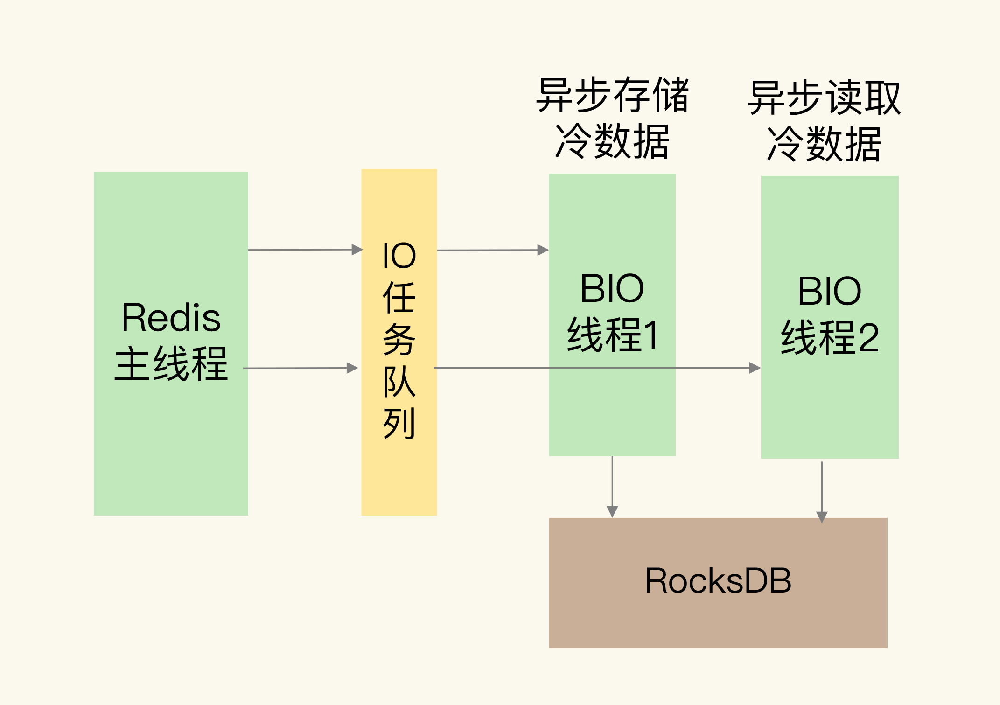

# 第 44 章 从微博的Redis实践中，我们可以学到哪些经验？

## 1. 微博对 Redis 的基本改进

根据微博技术专家的分享，我们可以发现，微博对 Redis 的基本改进可以分成两类：避免阻塞和节省内存。

### 1.1 避免阻塞

首先，针对持久化需求，他们使用了全量 RDB 加增量 AOF 复制结合的机制，这就避免了数据可靠性或性能降低的问题。当然，Redis 在官方 4.0 版本之后，也增加了混合使用 RDB 和 AOF 的机制。

其次，在 AOF 日志写入刷盘时，用额外的 BIO 线程负责实际的刷盘工作，这可以避免 AOF 日志慢速刷盘阻塞主线程的问题。

再次，增加了 aofnumber 配置项。这个配置项可以用来设置 AOF 文件的数量，控制 AOF 写盘时的总文件量，避免了写入过多的 AOF 日志文件导致的磁盘写满问题。

最后，在主从库复制机制上，使用独立的复制线程进行主从库同步，避免对主线程的阻塞影响。

### 1.2 节省内存

在节省内存方面，微博有一个典型的优化，就是定制化数据结构。

在使用 Redis 缓存用户的关注列表时，针对关注列表的存储，他们定制化设计了 LongSet 数据类型。这个数据类型是一个存储 Long 类型元素的集合，它的底层数据结构是一个 Hash 数组。在设计 LongSet 类型之前，微博是用 Hash 集合类型来保存用户关注列表，但是，Hash 集合类型在保存大量数据时，内存空间消耗较大。

而且，当缓存的关注列表被从 Redis 中淘汰时，缓存实例需要从后台数据库中读取用户关注列表，再用 HMSET 写入 Hash 集合，在并发请求压力大的场景下，这个过程会降低缓存性能。跟 Hash 集合相比，LongSet 类型底层使用 Hash 数组保存数据，既避免了 Hash 表较多的指针开销，节省内存空间，也可以实现快速存取。

## 2. 微博如何应对大容量数据存储需求？

微博业务层要保存的数据经常会达到 TB 级别，这就需要扩大 Redis 实例的存储容量了。针对这个需求，微博对数据区分冷热度，把热数据保留在 Redis 中，而把冷数据通过 RocksDB 写入底层的硬盘。

在微博的业务场景中，冷热数据是比较常见的。比如说，有些微博话题刚发生时，热度非常高，会有海量的用户访问这些话题，使用 Redis 服务用户请求就非常有必要。但是，等到话题热度过了之后，访问人数就会急剧下降，这些数据就变为冷数据了。这个时候，冷数据就可以从 Redis 迁移到 RocksDB，保存在硬盘中。这样一来，Redis 实例的内存就可以节省下来保存热数据，同时，单个实例能保存的数据量就由整个硬盘的大小来决定了。

## 3. 面向多业务线，微博如何将 Redis 服务化？

为了能够灵活地支持这些业务需求，微博对 Redis 进行了服务化改造（RedisService）。所谓服务化，就是指，使用 Redis 集群来服务不同的业务场景需求，每一个业务拥有独立的资源，相互不干扰。同时，所有的 Redis 实例形成一个资源池，资源池本身也能轻松地扩容。如果有新业务上线或是旧业务下线，就可以从资源池中申请资源，或者是把不用的资源归还到资源池中。

形成了 Redis 服务之后，不同业务线在使用 Redis 时就非常方便了。不用业务部门再去独立部署和运维，只要让业务应用客户端访问 Redis 服务集群就可以。即使业务应用的数据量增加了，也不用担心实例容量问题，服务集群本身可以自动在线扩容，来支撑业务的发展。

在 Redis 服务化的过程中，微博采用了类似 Codis 的方案，通过集群代理层来连接客户端和服务器端。从微博的公开技术资料中，可以看到，他们在代理层中实现了丰富的服务化功能支持。

- 客户端连接监听和端口自动增删。
- Redis 协议解析：确定需要路由的请求，如果是非法和不支持的请求，直接返回错误。
- 请求路由：根据数据和后端实例间的映射规则，将请求路由到对应的后端实例进行处理，并将结果返回给客户端。
- 指标采集监控：采集集群运行的状态，并发送到专门的可视化组件，由这些组件进行监控处理。

此外，在服务化集群中，还有一个配置中心，它用来管理整个集群的元数据。同时，实例会按照主从模式运行，保证数据的可靠性。不同业务的数据部署到不同的实例上，相互之间保持隔离。

当把一个通用功能做成平台服务时，我们需要重点考虑的问题，包括**平台平滑扩容、多租户支持和业务数据隔离、灵活的路由规则、丰富的监控功能**等。